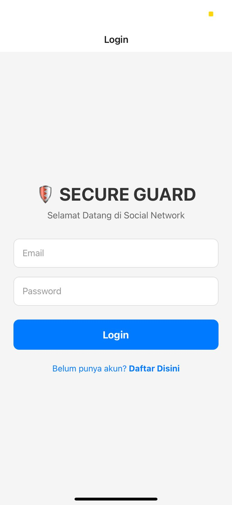
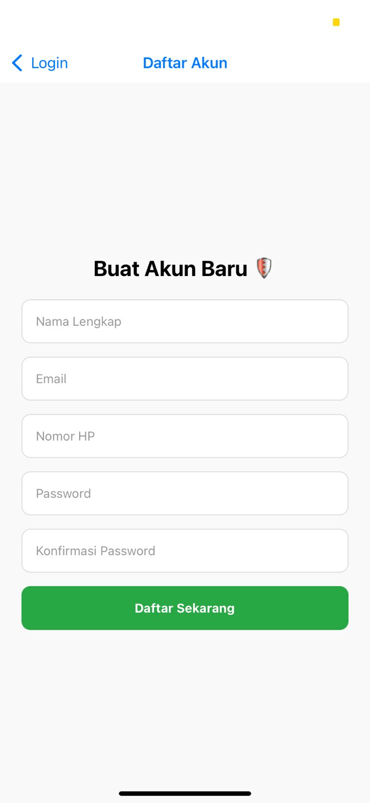
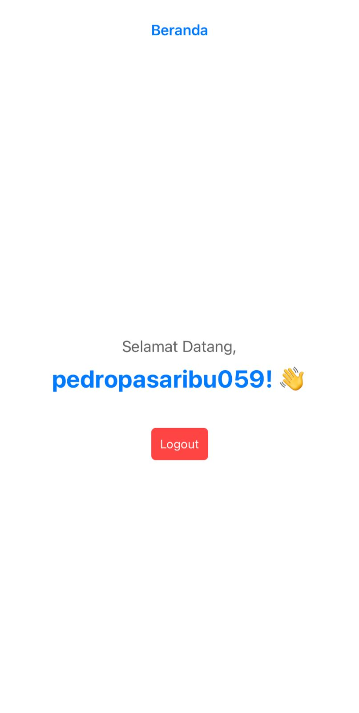

# Mission 5: The Secure Guard 🛡️
**Oleh: Pedro Pasaribu**

Project ini adalah aplikasi autentikasi sederhana yang dibangun menggunakan **Expo Router** untuk memenuhi tugas PERTEMUAN 5. Aplikasi ini memiliki fitur validasi keamanan (Security Logic) pada halaman registrasi.

## 🚀 Fitur & Validasi:
- [x] **Stack Navigation:** Navigasi antar halaman menggunakan Expo Router.
- [x] **Login Screen:** Fitur masuk dengan validasi format dasar.
- [x] **Secure Register:** - Validasi Email (RegEx).
    - Validasi Nomor HP (Minimal 10 Digit).
    - Validasi Password Match (Kesesuaian kata sandi).
- [x] **Home Screen:** Menampilkan nama user yang berhasil login.
- [x] **UX Optimization:** Menggunakan KeyboardAvoidingView.

## 🔗 Live Demo (Expo Snack)
[Klik di sini untuk mencoba via Expo Snack](ISI_LINK_EXPO_SNACK_LO_DI_SINI)

## 📸 Dokumentasi Program

### 1. Halaman Login

### 2. Halaman Register

### 3. Halaman Beranda (Home)
